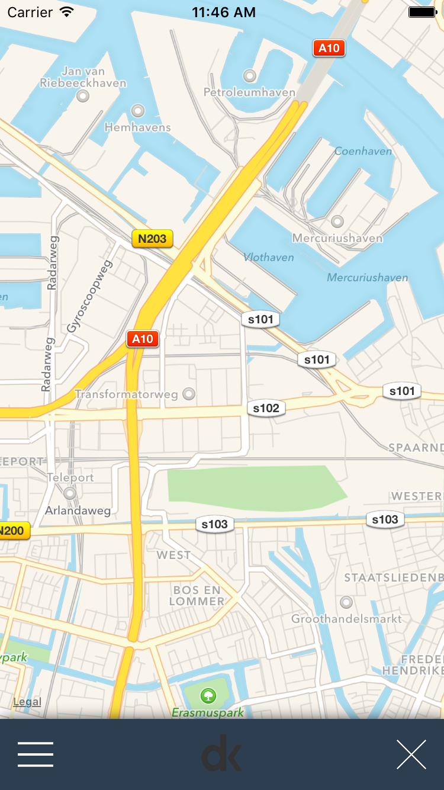
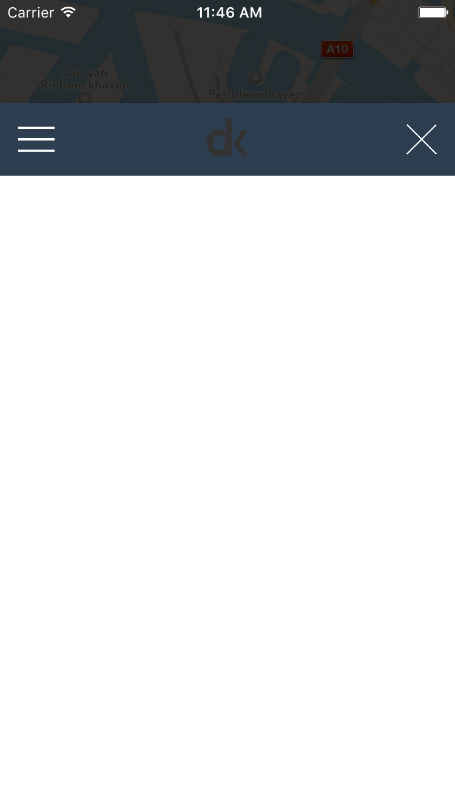

# DKBottomBarViewController
DKBottomBarViewController is a delightfull way to create a bottom based navigation or search solution (or whatever you want to do with it) on iOS.

## Example
  &nbsp;&nbsp;&nbsp;&nbsp;  <br>

## How To Get Started

## Installation
Just drag and drop the files inside your project.<br>
this project is written in swift so you might need to use an Umbrella Header for your Objective-C project.

## Architecture
DKBottomBarViewController is used with a DKBottomBarViewControllerConfiguration object to define several properties.

### Configurable options

#### topBarHeight : CGFloat?
Height of the upper bar.

#### topBarBackgroundColor : UIColor?
Background color of the upper bar.

#### topBarShadow : Bool?
Determines wether the upper bar has a shadow.

#### overlayViewBackgroundColor : UIColor?
The color used for the view that overlays the main content view.

#### overlayViewMaxOpacity : CGFloat?
Max opacity that the overlay view fades to upon move of the DKBottomBarViewController

#### maxTopTreshold : CGFloat?
Max distance that the DKBottomBarViewController has in relation to the parent view controller in its opened state (when the whole view controller is visible).

#### velocityNegativeTreshold : CGFloat?
Treshold for the velocity on the Y axis that determines if the transition of the DKBottomBarViewController should automatically be completed to its closed stated.

#### velocityPositiveTreshold : CGFloat?
Treshold for the velocity on the Y axis that determines if the transition of the DKBottomBarViewController should automatically be completed to its opened stated.

#### panGestureAttachment : DKBottomBarViewControllerPanGestureAttachment?
Determines on which part of the DKBottomBarViewController the UIPanGestureRecognizer is attached to.

#### leftButtonDimensions : CGRect?
Determines the dimensions of the left button that lives inside the upper bar (Y dimensions are always ignored! this is because the buttons are centered on the vertical axis)

#### centerButtonDimensions : CGRect?
Determines the dimensions of the center button that lives inside the upper bar (Y dimensions are always ignored! this is because the buttons are centered on the vertical axis)

#### rightButtonDimensions : CGRect?
Determines the dimensions of the center button that lives inside the upper bar (Y dimensions are always ignored! this is because the buttons are centered on the vertical axis)

#### leftButtonImagePath : String?
UIImage resource path for the left button.

#### centerButtonImagePath : String?
UIImage resource path for the center button.

#### rightButtonImagePath : String?
UIImage resource path for the right button.

#### debug : Bool?
Determines wether to show debug statements and lines

#### duration : NSTimeInterval?
Duration of the animation

#### delay : NSTimeInterval?
Delay of the animation

#### springDamping : CGFloat?
Spring damping of the animation

#### initialSpringVelocity : CGFloat?
Spring velocity of the animation

#### options : UIViewAnimationOptions?
Options of the animation

## Usage

### Use DKBottomBarViewController inside an UIViewController

Initialize a new DKBottomBarViewControllerConfiguration and a new DKBottomBarViewController and add it to the parent view controller.

```swift
let configuration = DKBottomBarViewControllerConfiguration.standardConfiguration()
        
bottomBarViewController = DKBottomBarViewController(configuration: configuration)
bottomBarViewController!.addToParentViewController(self)
bottomBarViewController!.addGestureRecognizer()
bottomBarViewController!.delegate = self
```

If you want to use the provided delegate (and I recommend to do this), then don't forget to make you class conform to the DKBottomBarViewControllerDelegate protocol as follows :

```swift
class DKMainViewController: UIViewController, DKBottomBarViewControllerDelegate
```
To set the content view of the DKBottomBarViewController (the view that is contained inside this view controller) use `bottomBarViewController.setContentView(view : UIView)`
After setting the content view, DKBottomBarViewControllerDelegate will call out to `bottomBarViewControllerDidSetContentView()` to provide you with the content view and the horizontal and vertical constraint used to set the content view.

The DKBottomBarViewController has several delegate methods that you can use to get the current drag progress en several other things.

#### func bottomBarViewControllerDidChangeProgress(progress : CGFloat)
Called when the drag or animation progress changes.
#### func bottomBarViewControllerShow()
Called when the DKBottomBarViewController is shown.
#### func bottomBarViewControllerHide()
Called when the DKBottomBarViewController is hiden.
#### func bottomBarViewControllerDidReachTop()
Called when the DKBottomBarViewController reached the top.
#### func bottomBarViewControllerDidReachBottom()
Called when the DKBottomBarViewController reached the bottom.
    
#### func bottomBarViewControllerTraversal(traversal : CGPoint, velocity : CGPoint)
Called when the DKBottomBarViewController changes traversal or velocity on the Y axis.
#### func bottomBarViewControllerLeftButtonPressed(button : UIImageView)
Called when the left button of the DKBottomBarViewController is pressed.
#### func bottomBarViewControllerCenterButtonPressed(button : UIImageView)
Called when the center button of the DKBottomBarViewController is pressed.
#### func bottomBarViewControllerRightButtonPressed(button : UIImageView)
Called when the right button of the DKBottomBarViewController is pressed.
    
#### func bottomBarViewControllerDidSetContentView(contentView : UIView, horizontalConstraints : [NSLayoutConstraint], verticalConstraints : [NSLayoutConstraint])
Called when `bottomBarViewController.setContentView(view : UIView)` is used, this method provides you with the final content view and the horizontal and vertical constraints used to set the content view